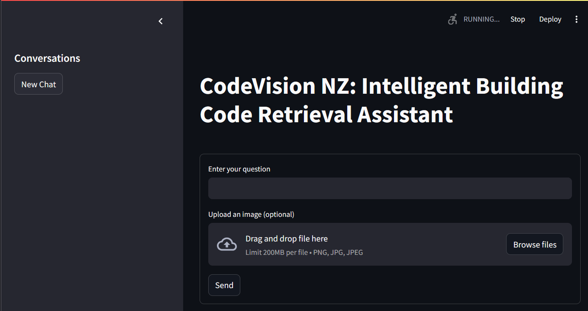
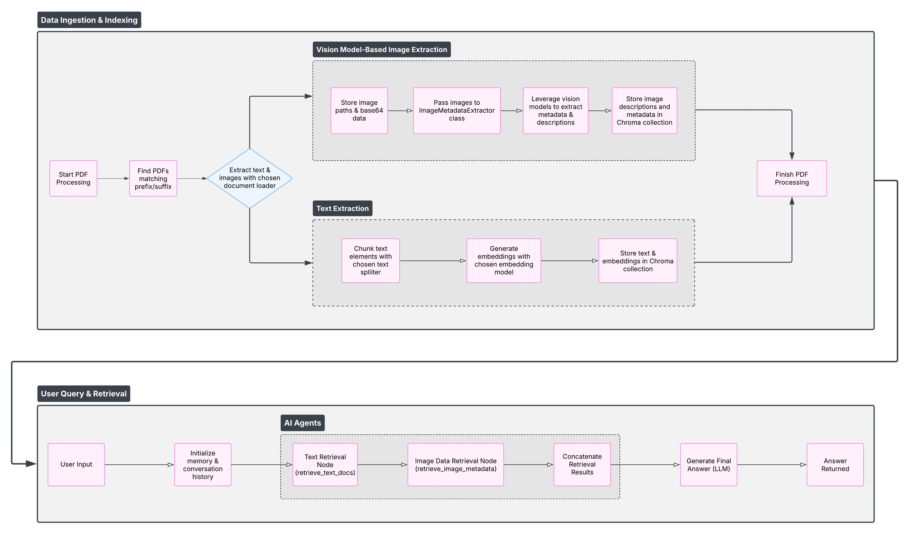

# CodeVision NZ: Intelligent Building Code Retrieval

## Overview

**CodeVision NZ** is an AI-powered personal project designed to simplify information retrieval from the New Zealand Building Code documentation. Leveraging open-source technologies, it efficiently extracts, indexes, and retrieves textual and visual data from PDF documents.

---

## Screenshots and Diagrams

### Application Interface

### Sample Extracted Images and Tables

### Workflow Diagram

---

## Project Workflow

### 1. Data Ingestion and Indexing

The workflow begins by processing PDF documents related to the New Zealand Building Code.

- **PDF Identification:**
  - Automatically detects PDFs based on filename prefixes/suffixes.

- **Content Extraction:**
  - Extracts text and images from identified PDFs.

### 2. Image and Text Processing

The project splits into two concurrent processing streams:

#### Vision Model-Based Image Extraction

- Images are stored locally as paths and base64-encoded data.
- Extracted images pass through an `ImageMetadataExtractor`.
- Vision models analyze images to generate descriptive metadata.
- Metadata and descriptions are stored locally using Chroma vector storage.

#### Text Extraction

- PDF text content is split into manageable chunks using a text splitter.
- Each text chunk is processed through a text embedding model to generate embeddings.
- Text embeddings and original texts are stored locally in the Chroma vector database.

### 3. Retrieval and Response

The retrieval process is powered by AI agents:

- **User Interaction:**
  - Users submit queries via a simple chat interface.

- **AI Retrieval:**
  - Retrieves relevant text and image data based on query embeddings.
  - Combines both text and visual data for comprehensive results.

- **Answer Generation:**
  - Leveraging Language Models (LLMs), generates coherent and contextually accurate responses.

---

## Tools and Methods

- **Document Extraction:** Unstructured
- **Vision Analysis:** Open-source Vision Transformer models, HuggingFace libraries
- **Text Embedding:** SentenceTransformers (open-source embedding models)
- **Vector Storage:** Chroma Vector Database
- **Language Model:** Open-source LLMs (e.g., Ollama models, GPT-Neo, LLaMA)
- **Deployment Interface:** Streamlit (for local deployment)

---

## Key Features

- Locally deployable, secure, and privacy-focused
- Fully open-source stack
- Quick, context-sensitive retrieval
- Easy-to-use conversational interface

---
